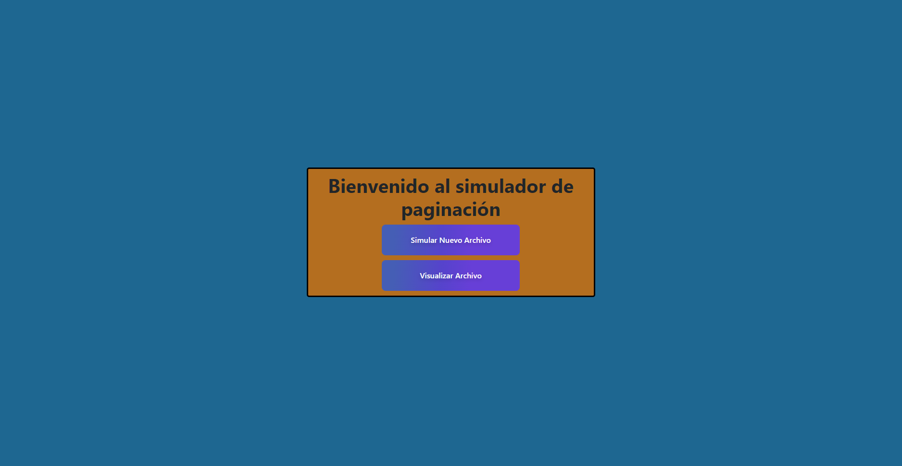
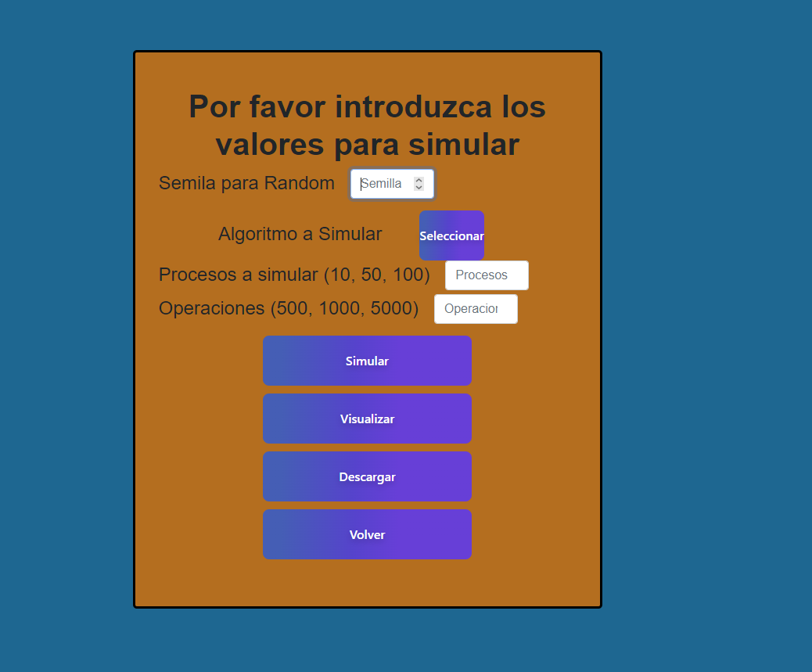
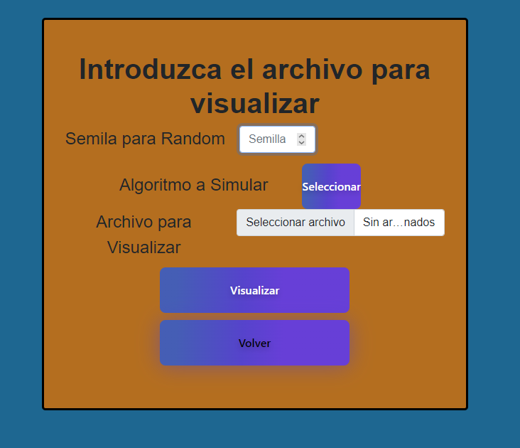
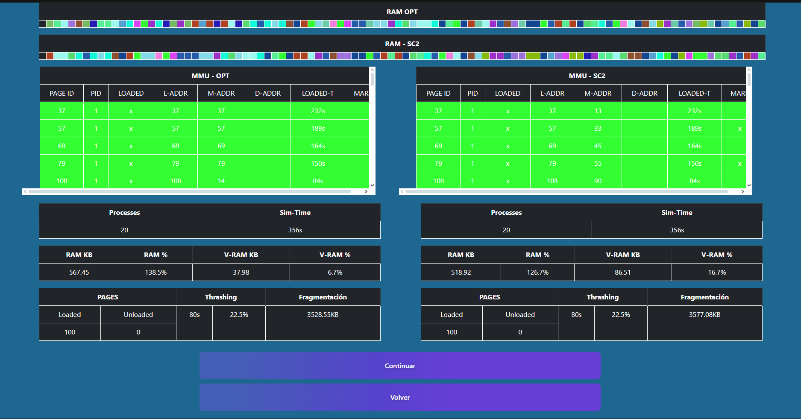

# ProyectoPaginacion

## Autores

- **Fernando Gross** 
- **Dylan Mora** 
- **Roberto Vindas** 

## Instalación y Ejecución
### 1. Dar permisos al archivo `run.sh`
Hay que correr el archivo de bash llamado run.sh, para hacer que corra hay que darle permisos, esto se hace escribiendo lo siguiente en la linea de comandos de linux.
```bash
chmod +x run.sh
```
### 2. Instalación de Google Chrome
Luego de esto se va a instalar el navegador Google Chrome y se va a ejecutar el archivo HTML de despliegue del front end.

### 3. Interfaz
Al ingresar al front end se va a ver una pantalla con dos opciones, simular un nuevo archivo o visualizar un archivo viejo como se ve en la figura



Al presionar el primer botón aparece la pantalla de simular nuevo archivo en el cual se puede brindar una semilla para la generación aleatoria del archivo y para la simulación del algoritmo random, también se puede seleccionar el algoritmo a simular (FIFO, SC, MRU, RND), la cantidad de procesos a simular y la cantidad de operaciones a simular, de igual manera se puede simular el archivo, ver la simulación y/o descargar el archivo, cabe recalcar que es obligatorio simular el archivo para poder descargarlo y para poder visualizarlo, la pantalla se puede ver en la figura



Al presionar el segundo botón en la pantalla de inicio se ingresa a la pantalla
de cargar un archivo ya creado, también se puede escoger la semilla si se quiere
simular el algoritmo random y visualizar el archivo, esta pantalla se puede ver
en la figura



Por último si se presiona el botón de visualizar en cualquiera de las pantallas
descritas anteriormente se puede ver una simulación de las operaciones y los
procesos que se encuentren en el archivo junto con diferentes datos relacionados
a el manejo de memoria, thrashing y el tiempo de simulación, la visualización
se ve ilustrada en la figura


